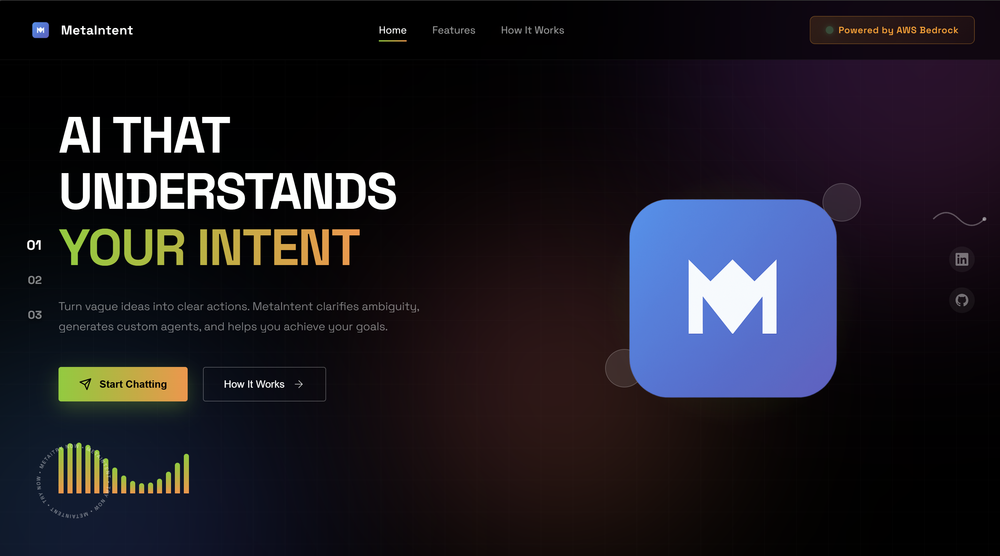
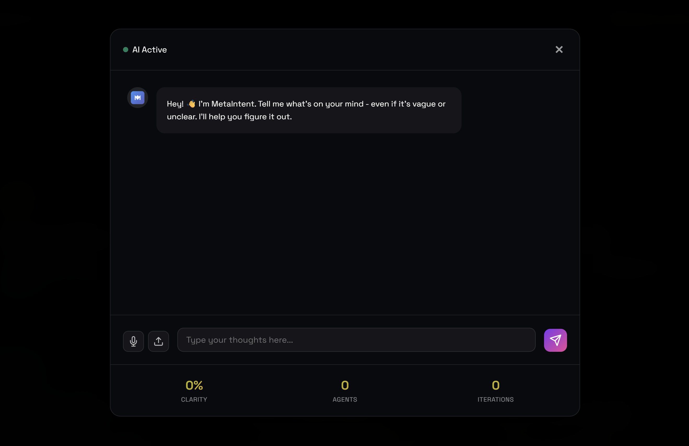
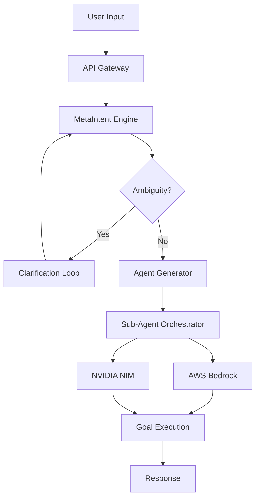

<div align="center">


# 🤖 MetaIntent

### Self-Evolving AI Agent System with AWS Bedrock & NVIDIA NIM

[](https://main.d2hb7u72uflrkw.amplifyapp.com/)
[](https://github.com/Hammaduddin561/MetaIntent)
[](https://www.typescriptlang.org/)
[](https://aws.amazon.com/bedrock/)

*Turn vague ideas into clear actions. MetaIntent clarifies ambiguity, generates custom agents, and helps you achieve your goals.*

[Features](#-features) • [Architecture](#️-architecture) • [Quick Start](#-quick-start)

</div>

---

## 📸 Screenshots

<div align="center">

<table>
<tr>
<td width="50%">

<p><em>Clean, modern landing page with gradient design</em></p>
</td>
<td width="50%">

<p><em>Interactive AI chat with real-time metrics</em></p>
</td>
</tr>
</table>

</div>

---

## 🌟 Features

<table>
<tr>
<td width="50%">

### 🎯 **Intelligent Intent Understanding**
- Advanced ambiguity detection
- Context-aware clarification
- Goal-oriented conversation flow

### 🔄 **Self-Evolving Agents**
- Dynamic agent generation
- Autonomous API orchestration
- Adaptive task execution

</td>
<td width="50%">

### 🚀 **Multi-Modal Support**
- Voice input processing
- Document upload & analysis
- Text-based interactions

### ⚡ **Optimized Performance**
- Low-bandwidth optimization
- Aggressive caching strategy
- Cost-efficient

</td>
</tr>
</table>

---

## 🏗️ Architecture



### Tech Stack

<div align="center">

| Component | Technology |
|-----------|-----------|
| **Frontend** | HTML5, CSS3, Vanilla JavaScript |
| **Backend** | TypeScript, AWS Lambda |
| **AI Models** | AWS Bedrock (Claude 3.5), NVIDIA NIM |
| **API Gateway** | AWS API Gateway |
| **State Management** | AWS DynamoDB with TTL |
| **Storage** | AWS S3 (caching & logs) |
| **Deployment** | AWS Amplify, SAM |

</div>

---

## 🚀 Quick Start

### Prerequisites

```bash
# Required tools
- Node.js 20+
- AWS CLI configured
- AWS SAM CLI (optional)
```

### Installation

```bash
# Clone the repository
git clone https://github.com/Hammaduddin561/MetaIntent.git
cd MetaIntent

# Install dependencies
npm install

# Configure environment
cp .env.example .env
# Edit .env with your AWS credentials
```

### Local Development

```bash
# Build the project
npm run build

# Start local server
sam local start-api

# Or use simple Python server for frontend
python -m http.server 8000
```

### Deploy to AWS

```bash
# Automated deployment
npm run deploy

# Manual SAM deployment
sam build
sam deploy --guided
```

---

## 📁 Project Structure

```
MetaIntent/
├── 📄 index.html              # Main website
├── 🎨 style.css               # Styling
├── ⚡ script.js               # Client-side logic
├── 🖼️ metaintent_logo.png     # Logo assets
├── 📋 amplify.yml             # AWS Amplify config
├── 📦 src/
│   ├── adapters/              # LLM backend adapters
│   │   ├── BedrockAdapter.ts
│   │   ├── NIMAdapter.ts
│   │   └── LLMAdapterFactory.ts
│   ├── lambdas/               # Lambda handlers
│   │   ├── metaintent.ts
│   │   ├── intent.ts
│   │   ├── chain.ts
│   │   └── router.ts
│   ├── services/              # Core services
│   │   ├── MetaLoopEngine.ts
│   │   ├── AmbiguityDetector.ts
│   │   ├── AgentGenerator.ts
│   │   └── SubAgentOrchestrator.ts
│   ├── models/                # Type definitions
│   └── utils/                 # Utilities (cache, retry, logger)
├── 🚀 lambda-deploy/          # Lambda deployment
├── ⚛️ metaintent-webapp/      # React webapp
└── 📚 README.md               # This file
```

---

## 💡 How It Works

1. **Input Processing**: Accept voice, text, or document input
2. **Ambiguity Detection**: Identify unclear or incomplete requests
3. **Clarification Loop**: Engage in conversation to refine intent
4. **Agent Generation**: Create specialized sub-agents for specific tasks
5. **Orchestration**: Coordinate multiple agents and API calls
6. **Execution**: Deliver results with graceful fallback handling

---

## 🧪 Testing

### Test the Live API

```bash
curl -X POST https://main.d2hb7u72uflrkw.amplifyapp.com/api/onboard \
  -H "Content-Type: application/json" \
  -d '{"input": "Help me build a website", "modality": "text"}'
```

### Local Testing

```bash
# Run tests
npm test

# Test specific lambda
sam local invoke MetaIntentFunction --event events/test-event.json
```

---

## 📄 License

This project is licensed under the MIT License.

```
MIT License

Copyright (c) 2025 Md Hammaduddin

Permission is hereby granted, free of charge, to any person obtaining a copy
of this software and associated documentation files (the "Software"), to deal
in the Software without restriction, including without limitation the rights
to use, copy, modify, merge, publish, distribute, sublicense, and/or sell
copies of the Software, and to permit persons to whom the Software is
furnished to do so, subject to the following conditions:

The above copyright notice and this permission notice shall be included in all
copies or substantial portions of the Software.

THE SOFTWARE IS PROVIDED "AS IS", WITHOUT WARRANTY OF ANY KIND, EXPRESS OR
IMPLIED, INCLUDING BUT NOT LIMITED TO THE WARRANTIES OF MERCHANTABILITY,
FITNESS FOR A PARTICULAR PURPOSE AND NONINFRINGEMENT. IN NO EVENT SHALL THE
AUTHORS OR COPYRIGHT HOLDERS BE LIABLE FOR ANY CLAIM, DAMAGES OR OTHER
LIABILITY, WHETHER IN AN ACTION OF CONTRACT, TORT OR OTHERWISE, ARISING FROM,
OUT OF OR IN CONNECTION WITH THE SOFTWARE OR THE USE OR OTHER DEALINGS IN THE
SOFTWARE.
```

---

## 🤝 Contributing

Contributions are welcome! Please feel free to submit a Pull Request.

---

<div align="center">

### ⭐ Star this repo if you find it helpful!

Made with ❤️ using AWS Bedrock & NVIDIA NIM
-
[📝 Report Bug](https://github.com/Hammaduddin561/MetaIntent/issues) • [💡 Request Feature](https://github.com/Hammaduddin561/MetaIntent/issues)

</div>
